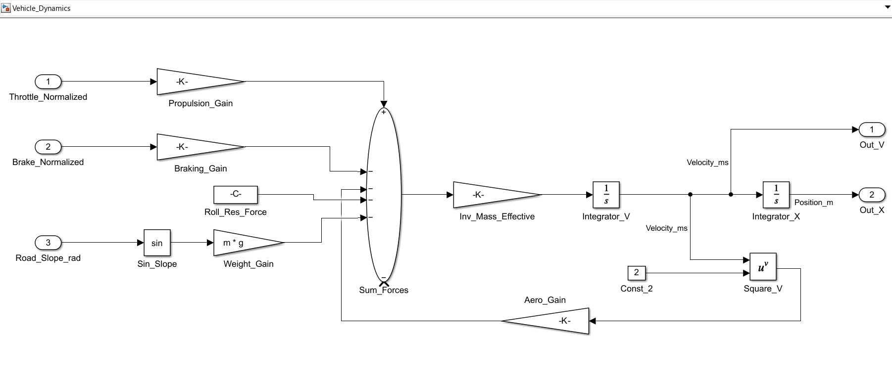
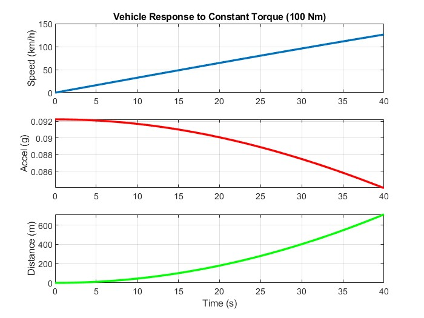
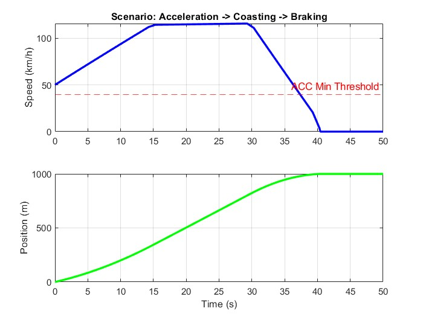
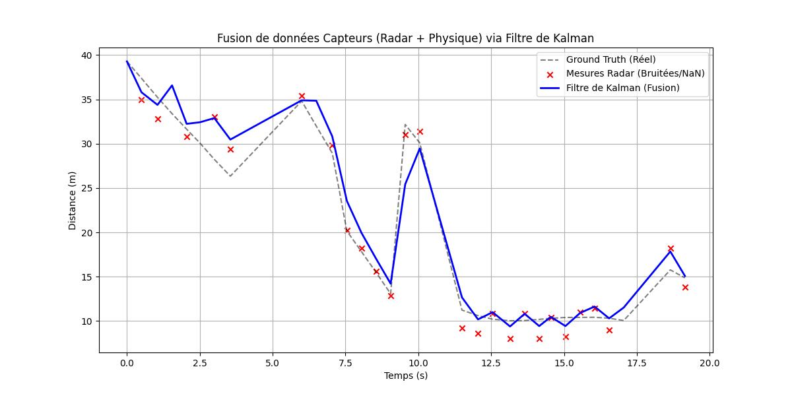
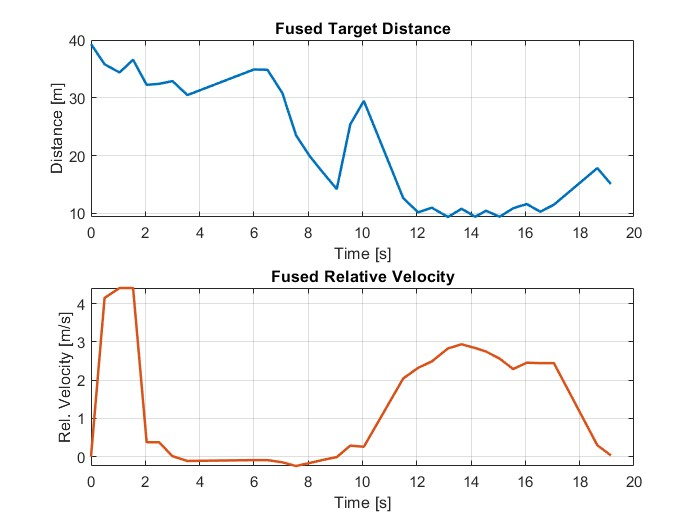
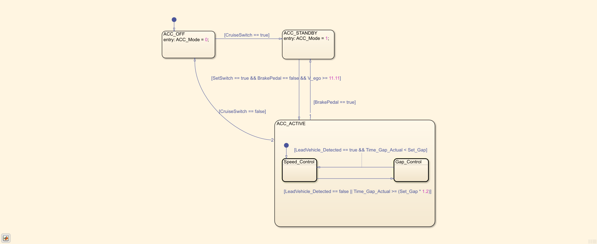
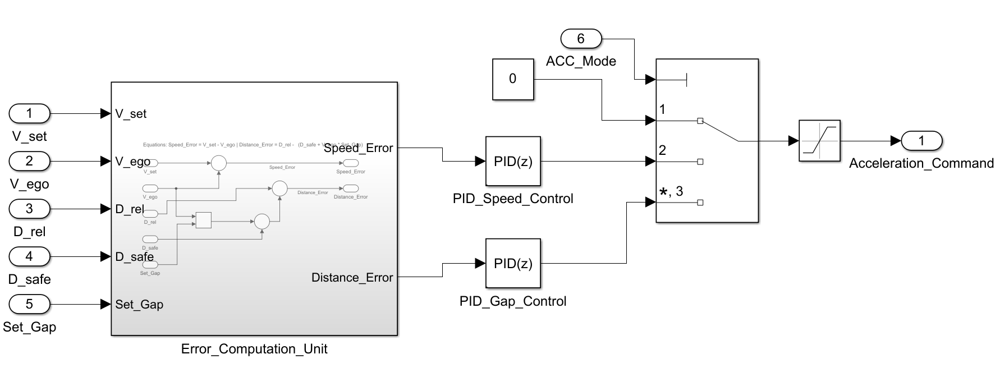

# Adaptive-Cruise-Control-System

This repository documents the development of an **ADAS Adaptive Cruise Control (ACC)** function **aligned with automotive engineering practices**. The work is structured to support traceability, modularity, and progressive verification in a way that is consistent with the intent of **ISO 26262** (functional safety) development processes.

The solution is organized into **four complementary work packages**, covering the pipeline from perception outputs to controller verification and validation.

---

## Work Package 1 — Perception and Data Interpretation (Camera + Radar, simulation-based)

The **Perception Module** ingests **simulated sensor outputs** (camera images and radar-like measurements) rather than real hardware signals. An **AI-based processing stage** transforms the raw inputs into a stable and interpretable set of variables relevant to longitudinal control, for example:
- lead target distance,
- relative speed,
- lane association / same-lane classification,
- target validity indicators.

A key objective is **robust signal conditioning**: cleaning, smoothing, and validating outputs to ensure consistent behavior of the downstream ACC function. The design is intentionally modular so that the ACC controller does not depend on the internal details of the sensor processing implementation.

---

## Work Package 2 — ACC Control Development using Model-Based Design (MBD)

The **ACC Control Module** is developed in **MATLAB/Simulink** following **Model-Based Design (MBD)** principles. The architecture includes:

- **Stateflow supervisory logic** to manage operational modes, including:
  - standby,
  - cruise speed control,
  - following / gap control,
  - overrides and fallback behavior.

- A **PID-based longitudinal control strategy** producing acceleration demand, later mapped to:
  - **throttle command**
  - **brake command**

- A **vehicle longitudinal dynamics plant model** to simulate ego vehicle response in closed loop.

The primary control objective is to maintain a **safe time headway** to a detected lead vehicle while ensuring:
- comfort (smooth responses),
- stability,
- bounded actuator commands,
- safe fallback behavior when target information is invalid or inconsistent.

---

## Work Package 3 — Driving Scenario Simulation Environment

A scenario simulation layer is planned to evaluate the ACC function across representative use cases, such as:
- lead vehicle braking events,
- target cut-in / cut-out,
- speed changes and set-speed tracking,
- variations in initial spacing and relative speed.

The visualization and execution environment is under selection (e.g., **3D**, **bird’s-eye view**, or **2D**). The intent is to support:
- **repeatable scenario playback**
- structured coverage of key ACC behaviors
- measurable performance assessment across scenarios.

---

## Work Package 4 — Verification and Validation (MIL and SIL)

To align with automotive development and safety-oriented verification strategies, the project includes staged testing:

- **Model-in-the-Loop (MIL)** testing  
  Used to validate control logic, Stateflow mode behavior, and closed-loop performance at the Simulink model level.

- **Software-in-the-Loop (SIL)** testing (selected modules)  
  Used to execute generated code for early assessment of:
  - model-to-code equivalence,
  - numerical behavior changes,
  - implementation constraints and integration readiness.

---

## 📊 Project Progress

### 1. Model-Based Design (MBD) - Vehicle Dynamics
- [x] **Validated Dynamic Model:** Developed `Vehicle_Dynamics.slx`, a high-fidelity longitudinal model including aerodynamic drag, rolling resistance, and mass inertia.
- [x] **Open-Loop Validation:** Verified model response against theoretical curves (Acceleration/Braking) in `validate_dynamics_open_loop.m`.
- [x] **Initialization:** Centralized parameters in `init_params.m` using SI units.

#### Vehicle Dynamics Model Overview
The longitudinal dynamics model captures the physical response of the ego vehicle to throttle and brake commands.

#### Performance Validation
Validation tests confirm the model's accuracy in representing acceleration and deceleration phases.

  
  

### 2. Perception & AI Environment
- [x] **Environment Setup:** Configured Python environment with PyTorch and nuScenes-devkit.
- [x] **Dataset Preparation:** Downloaded and integrated **nuScenes-mini**.
- [x] **Data Extraction:** Created `extract_radar_data.py` to bridge nuScenes data with MATLAB.
- [x] **YOLO Perception:** Implemented YOLOv8 vehicle detection and distance estimation.
- [x] **Sensor Fusion:** Implemented Linear Kalman Filter (LKF) to merge Radar and Vision data.
- [x] **Data Import:** Created `import_fusion_data.m` to generate timeseries for Simulink.

#### Sensor Fusion & Data Import
The perception pipeline concludes with a fusion stage that stabilizes the target tracking.

  
  

### 3. ACC Control Development (WP2)
- [x] **Supervisory Logic:** Developed `ACC_Mode_Manager.slx` using Stateflow for mode management (Standby, Speed, Gap).
- [x] **Longitudinal Control:** Implemented `ACC_Controller.slx` with dual PID loops and safety saturation ($\pm 0.2g$).

#### Mode Manager & PID Controller
The controller architecture separates high-level decision making from low-level regulation.

  

  

### 4. Next Steps
- Integrate the controller with the vehicle dynamics model in a closed-loop simulation.
- Implement the Vehicle Control Interface (VCI) for throttle/brake mapping.
- Tune PID gains for optimal comfort and safety.

